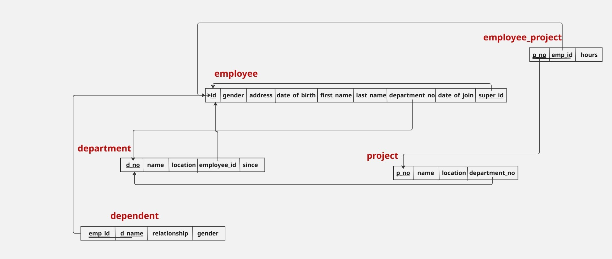
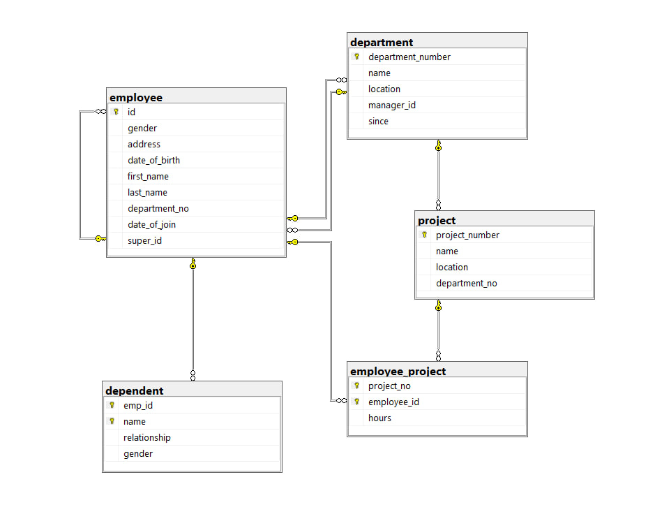

# Database Design & Implementation: From Scratch

## Project Overview
This repository showcases a full-lifecycle database engineering project. It moves from raw business requirements to a finalized, queried relational database system using **Microsoft SQL Server**. The project demonstrates advanced relational modeling, solving structural conflicts, and extracting business intelligence through complex SQL queries.

---

## 1. Discovery & Analysis: Software Requirements Specification (SRS)
Every robust database begins with a deep understanding of the business domain. In this stage, I acted as a Data Architect to analyze the needs of a corporate entity. This involved identifying stakeholders (Employees, Managers, Departments) and their operational interactions (Projects, Locations, Dependents).

The **SRS** document serves as the "Source of Truth," defining the rules of the system, such as "Every department must have a manager" and "A project can involve multiple employees."

*   **View the Analysis Document:** [(SRS).pdf](./docs/(SRS).pdf)

---

## 2. Conceptual Design: Entity Relationship Diagram (ERD)
Using the SRS as a guide, I constructed the **ERD**. This is the blueprint of the database. It visualizes the entities as objects and defines their attributes and cardinality (One-to-One, One-to-Many).

Key features of this model include:
- Establishing a self-referencing relationship for the "Supervisor" hierarchy.
- Defining the "Manages" relationship between Employees and Departments.
- Mapping the "Works_on" relationship to track employee hours per project.

.png)

---

## 3. Logical Design: Relational Mapping
Conceptual models (ERD) cannot be directly implemented into SQL without a mapping phase. In this step, I translated the ERD into a **Logical Schema**. This involved:
- **Normalization**: Ensuring the tables are organized to reduce data redundancy.
- **Junction Tables**: Resolving Many-to-Many relationships (e.g., Employees and Projects) into physical tables that track shared data (like 'Hours').
- **Integrity Constraints**: Defining which fields are Mandatory (NOT NULL) and which are Unique.

---

## 4. Physical Implementation: SQL Data Definition (DDL)
The actual build happens in the [Initialization_table.sql](./sql_code/Initialization_table.sql) file. This stage is where the architecture meets the machine.

### The Circular Dependency Solution
A major challenge in corporate databases is the "Chicken and Egg" problem. For example, the `Department` table needs an `Employee_ID` for its manager, but the `Employee` table needs a `Department_ID` to know where they work.

**My Technical Approach:**
Instead of defining all constraints at the moment of creation, I utilized a professional execution sequence:
1.  **Creation Phase**: Execute `CREATE TABLE` for all entities (Employee, Dept, Project, etc.) with only their Primary Keys.
2.  **Constraint Phase**: Use `ALTER TABLE` commands to inject the Foreign Keys. This allows SQL Server to build the tables without failing due to missing references, ensuring a clean and error-free deployment.

---

## 5. Data Manipulation & Business Intelligence: Queries
A database is only as good as the information you can extract from it. In the [queries.sql](./sql_code/queries.sql) file, I developed a series of complex scripts to simulate real-world business requests.

**What these queries achieve:**
- **Organizational Insights**: Retrieving full employee profiles along with their supervisor's names using Self-Joins.
- **Project Management**: Calculating the total hours spent by all employees on specific projects.
- **Aggregated Reporting**: Finding the average salary per department or identifying departments with more than a specific number of employees.
- **Referential Integrity Testing**: Commands that demonstrate how the database protects data (e.g., preventing the deletion of a department that still has active projects).

---

## 6. Final Database Schema
The final schema is the result of all previous stages combined. It represents a fully relational, normalized, and optimized database environment ready for a production-level application.

---

##  Developed & Documented by

## **Yossef Haytham**

[Portfolio](https://yossefhaytham.github.io/) • [LinkedIn](https://www.linkedin.com/in/yossefhaythammohammed)

